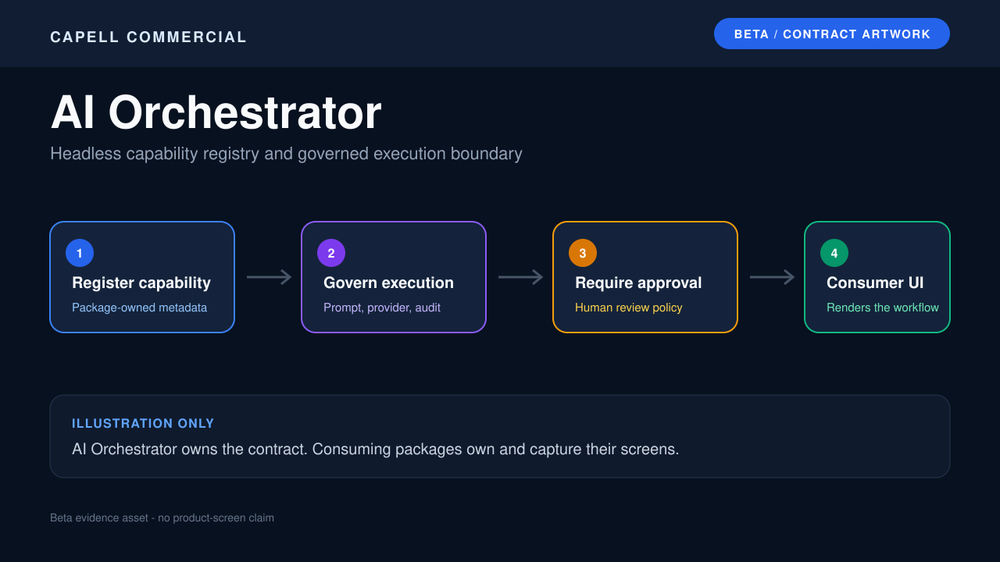

# AI Orchestrator

<!-- prettier-ignore-start -->

## What This Plugin Adds

AI Orchestrator is an **Available**, **Schema-owning** Capell package in the **Capell Commercial** product group. It ships as `capell-app/ai-orchestrator` and extends these surfaces: admin.

A shared AI capability registry and execution contract for Capell packages, designed for governed prompts, approvals, and package-owned AI workflows.

After install, admins get package-owned management or reporting surfaces inside Capell.

Status details:

- Status: Available
- Tier: premium
- Bundle: commercial
- Composer package: `capell-app/ai-orchestrator`
- Namespace: `Capell\AIOrchestrator`
- Theme key: not applicable

## Why It Matters

**For developers:** The package gives developers package-owned service providers, Actions, Data objects, models, Filament classes, and Blade views instead of pushing this behaviour into core or application code.

**For teams:** A shared AI capability registry and execution contract for Capell packages, designed for governed prompts, approvals, and package-owned AI workflows.

## Screens And Workflow

Screenshot contract: `docs/screenshots.json`.

- AI Orchestrator beta contract artwork (marketplace, required).

## Technical Shape

- Service providers: `Capell\AIOrchestrator\Providers\AIOrchestratorServiceProvider`.
- Config files: `packages/ai-orchestrator/config/capell-ai-orchestrator.php`.
- Migrations: `packages/ai-orchestrator/database/migrations/2026_05_10_190870_02_create_ai_generation_histories_table.php`, `packages/ai-orchestrator/database/migrations/2026_06_08_000001_add_cost_fields_to_ai_generation_histories_table.php`, `packages/ai-orchestrator/database/migrations/2026_07_10_000001_add_site_id_to_ai_generation_histories_table.php`, `packages/ai-orchestrator/database/migrations/2026_07_10_000002_create_ai_generation_requests_table.php`, `packages/ai-orchestrator/database/migrations/2026_07_10_000003_encrypt_ai_generation_history_payloads.php`, `packages/ai-orchestrator/database/migrations/2026_07_10_000003_encrypt_ai_generation_requests_table.php`.
- Settings migrations: `packages/ai-orchestrator/database/settings/2026_05_10_190871_01_create_ai-orchestrator_settings.php`.
- Settings classes: `AIOrchestratorSettings`.
- Models: `AIGenerationHistory`, `AiGenerationRequest`.
- Filament classes: `AIOrchestratorCapabilityCatalogPage`, `AIOrchestratorSettingsSchema`.
- Events: `AIOrchestratorCapabilityRunRecorded`, `AiGenerationCompleted`, `AiGenerationFailed`, `AiGenerationStarted`.
- Listeners: `LogAiGeneration`, `NotifyAiFailure`.
- Actions: `AssertAiModelPriceConfiguredAction`, `AssertAiRequestBudgetAction`, `EstimateAiGenerationCostAction`, `GeneratorPageContentAction`, `PruneAiGenerationPayloadsAction`, `RecordAiGenerationAction`, `SuggestMetaDescriptionsAction`, `SuggestPageTitlesAction`, `GenerateAiAssistantFieldsAction`, `ListAIOrchestratorCapabilitiesAction`, `QueueAiAssistantGenerationAction`, `RegisterAIOrchestratorModuleAction`, `and 1 more`.
- Data objects: `AIOrchestratorCapabilityData`, `AIOrchestratorRunData`, `AiGenerationInputData`, `AiGenerationResultData`, `AiSpendReservationData`, `AiAssistantGenerationData`, `AiAssistantGenerationResultData`.
- Jobs: `RunAiAssistantGenerationJob`.
- Command signatures: `capell:ai-orchestrator:prune-generation-payloads`.
- Console command classes: `PruneAiGenerationPayloadsCommand`.
- Manifest contributions: `admin-page: Capell\AIOrchestrator\Manifest\AiOrchestratorAdminPageContribution`, `console-command: Capell\AIOrchestrator\Manifest\AiOrchestratorPruneScheduleContribution`, `scheduled-job: Capell\AIOrchestrator\Manifest\AiOrchestratorPruneScheduleContribution`.
- Health checks: `Capell\AIOrchestrator\Health\AiOrchestratorHealthCheck`.
- Blade views: `packages/ai-orchestrator/resources/views/filament/pages/capability-catalog.blade.php`.

## Data Model

- Required tables: `ai_generation_histories`, `ai_generation_requests`.
- Models: `AIGenerationHistory`, `AiGenerationRequest`.
- Migration files: `2026_05_10_190870_02_create_ai_generation_histories_table.php`, `2026_06_08_000001_add_cost_fields_to_ai_generation_histories_table.php`, `2026_07_10_000001_add_site_id_to_ai_generation_histories_table.php`, `2026_07_10_000002_create_ai_generation_requests_table.php`, `2026_07_10_000003_encrypt_ai_generation_history_payloads.php`, `2026_07_10_000003_encrypt_ai_generation_requests_table.php`.
- Migration impact: run host migrations through the package install flow before opening package surfaces.
- Deletion/retention behaviour: Docs gap unless the package has an explicit pruning command, retention setting, or tested cascade path.

## Install Impact

- Admin navigation: adds package-owned Filament classes when registered.
- Permissions: none declared in `capell.json`.
- Public routes: none detected in package route files.
- Database changes: package migrations are declared.
- Settings: `Capell\AIOrchestrator\Settings\AIOrchestratorSettings`.
- Queues or schedules: review package jobs or schedules before install.
- Cache tags: none declared.
- Commands: `capell:ai-orchestrator:prune-generation-payloads`.

## Common Pitfalls

- Run migrations before opening package resources or public routes.
- Configure package settings before testing production-like workflows.
- Keep `composer.json`, `composer.local.json`, `capell.json`, docs, screenshots, and tests aligned when the package surface changes.

## Troubleshooting

| Symptom | Likely cause | Check | Fix |
| --- | --- | --- | --- |
| Package surface is missing after install | Provider or manifest is not loaded | Confirm `capell.json`, package `composer.json`, and provider registration | Reinstall the package, refresh Composer autoload, and clear host caches |
| Admin screen or command fails on missing table | Package migrations have not run | Check the tables listed in `Data Model` | Run host migrations and rerun the focused package test |
| Background work does not run | Queue worker or scheduled command is not active | Check package jobs, commands, and host scheduler configuration | Start the queue or scheduler, then run the focused command or package test |

## Quick Start

1. Install the package: `composer require capell-app/ai-orchestrator`.
2. Run the required setup: `php artisan migrate`.
3. Open the related Capell admin surface and verify AI Orchestrator appears.

## Next Steps

- [Package docs](docs/README.md)
- [Overview](docs/overview.md)
- [Screenshot contract](docs/screenshots.json)
- [Marketplace assets](docs/assets/marketplace/)
- [Capell content language plan](../../docs/CONTENT_LANGUAGE_PLAN.md)
- [Capell documentation design system](../../docs/DESIGN_SYSTEM.md)
- [Capell and package ERD notes](../../docs/erd/capell-and-package-erds.md)
- Related packages: [Layout Builder](../layout-builder/README.md), [Content Sections](../content-sections/README.md), [Media Ai](../media-ai/README.md), [Seo Suite](../seo-suite/README.md), [Translation Manager](../translation-manager/README.md).
- Focused tests: `vendor/bin/pest packages/ai-orchestrator/tests --configuration=phpunit.xml`.

<!-- prettier-ignore-end -->
